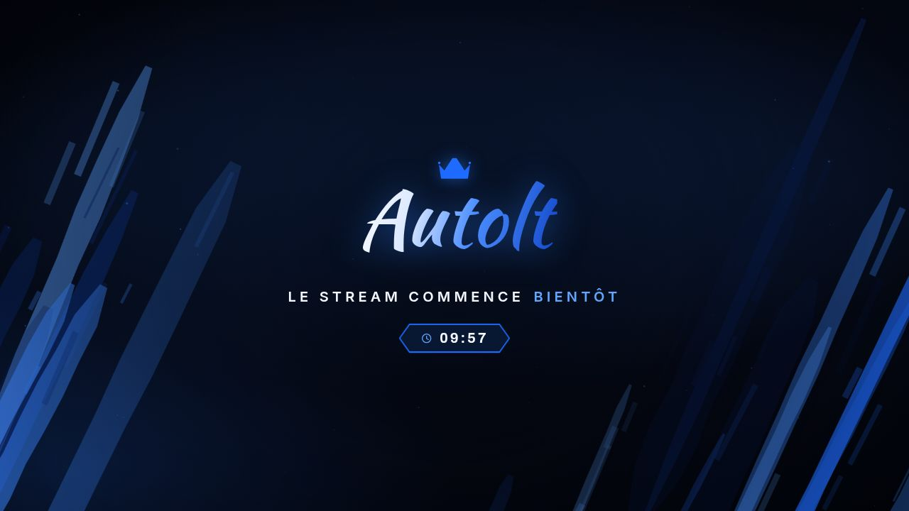

# Autolt — pack d'habillage OBS

Habillage complet de stream : **9 scènes**, **3 directions artistiques** et un
**stinger** (transition animée) pour chacune. Tout est en HTML/CSS/JS pur — aucun
build, aucun abonnement, aucune connexion internet nécessaire pendant le live.



---

## Démarrer en 2 minutes

```bash
# 1. Voir à quoi ça ressemble
open preview/index.html          # macOS   (Windows : start, Linux : xdg-open)

# 2. Installer dans OBS
node tools/make-obs-collection.mjs --da signature
# puis OBS ▸ Collection de scènes ▸ Importer ▸ dist/obs/autolt-signature.json
```

Tout est détaillé dans **[docs/OBS.md](docs/OBS.md)** (import automatique,
installation manuelle, tailles et positions exactes, réglage du stinger).

---

## Les 9 scènes

| # | Scène | Fichier | Transparent |
|---|-------|---------|-------------|
| 1 | Scène principale (jeu / live) | `overlays/live.html` | oui (`?layout=frame` : non) |
| 2 | Scène BRB (pause) | `overlays/pause.html` | non |
| 3 | Scène starting (+ minuterie) | `overlays/starting.html` | non |
| 4 | Scène webcam (cadre) | `overlays/webcam.html` | oui |
| 5 | Scène intermission / fin | `overlays/ending.html` | non |
| 6 | Overlay infos / alertes | `overlays/alerts.html` | oui |
| 7 | Panneau chat (cadre) | `overlays/chat.html` | oui |
| 8 | Scène offline | `overlays/offline.html` | non |
| 9 | Panneau profil / réseaux | `overlays/panels.html` | non |
| T | Transition (stinger) | `dist/stingers/stinger-*.webm` | oui (canal alpha) |

## Les 3 directions artistiques

| DA | URL | En deux mots |
|----|-----|--------------|
| **Signature** *(par défaut)* | `?da=signature` | Logotype manuscrit + couronne, coups de pinceau bleus, cadres néon |
| **Cobalt** | `?da=cobalt` | HUD e-sport, bleu électrique, panneaux biseautés |
| **Mono** | `?da=mono` | Noir & blanc brutaliste, typo massive, grain |

Détails et personnalisation des couleurs : **[docs/DA.md](docs/DA.md)**.

---

## Personnaliser

Tout se règle dans **`overlays/js/config.js`** : pseudo, accroche, réseaux,
phrases de chaque scène, durée des minuteries, infos de la scène de jeu.

```js
brand: 'Autolt',
tagline: 'STREAM // GAMING // GOOD VIBES',
socials: [{ icon:'youtube', label:'/Autolt' }, …],
scenes: { pause: { line: '*PAUSE* / JE REVIENS BIENTÔT' } },
```

Dans les phrases : `/` devient un séparateur bleu, `*mot*` met le mot en avant.

### Paramètres d'URL

| Paramètre | Effet |
|-----------|-------|
| `?da=signature\|cobalt\|mono` | change la direction artistique |
| `?t=900` | durée de la minuterie, en secondes |
| `?fx=low` | coupe les animations canvas (CPU ≈ 0) |
| `?layout=frame` | scène de jeu encadrée au lieu du plein écran |
| `?rail=cam` | remet la caméra à la place du chat sur la scène de jeu |
| `?guides=1` | affiche les zones du HUD de CS2 (scène de jeu) |
| `?pos=right\|top` | position des alertes / du chat |
| `?w=…&h=…` | taille du cadre webcam ou chat |
| `?bg=demo` | faux fond, pour prévisualiser une scène transparente |

---

## Outils

```bash
npm install                                  # Playwright (une seule fois)
node tools/screenshot.mjs                    # régénère toutes les vignettes
node tools/render-stinger.mjs [signature…]   # régénère les stingers WebM alpha
node tools/make-obs-collection.mjs --da …    # régénère la collection OBS
python3 tools/fetch-fonts.py                 # re-télécharge les polices
```

## Comment c'est fait

```
overlays/          les pages chargées par OBS
  config.js        ← le seul fichier à éditer au quotidien
  js/ui.js         moteur : thèmes, composants, effets canvas
  js/scenes.js     composition des 9 scènes
  js/transition.js stinger (rendu canvas déterministe)
  css/themes/*     une DA = un fichier de variables
  css/fonts.css    polices embarquées en base64 (aucun appel réseau)
dist/stingers/     transitions WebM prêtes pour OBS
dist/obs/          collections de scènes importables
preview/           panneau d'aperçu (ouvre index.html)
tools/             scripts de génération
docs/              installation OBS + détail des DA
```

Points d'attention : les pages sont en JavaScript classique (pas de modules
ES) et les polices sont embarquées en `data:` URI, parce que le navigateur
d'OBS charge les fichiers en `file://` et bloque le reste.
